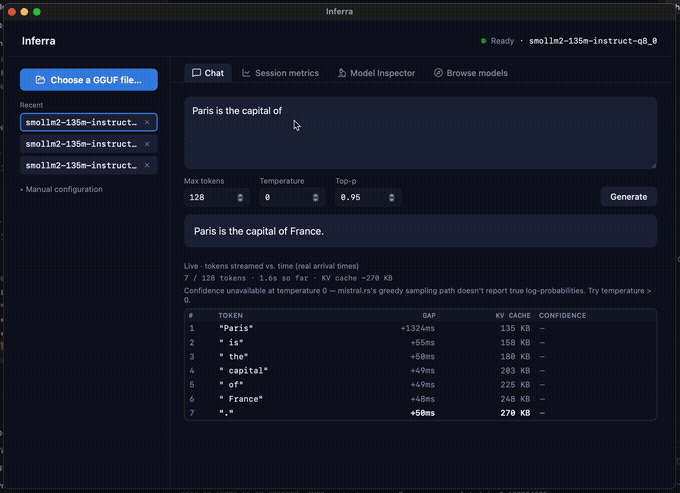
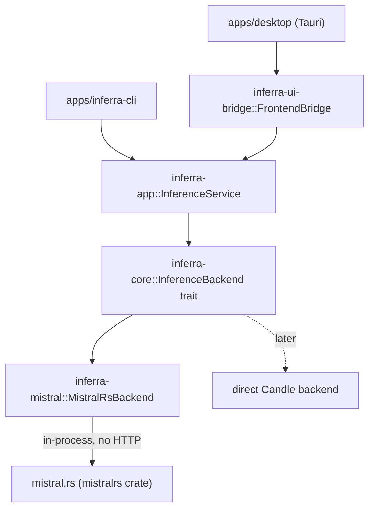
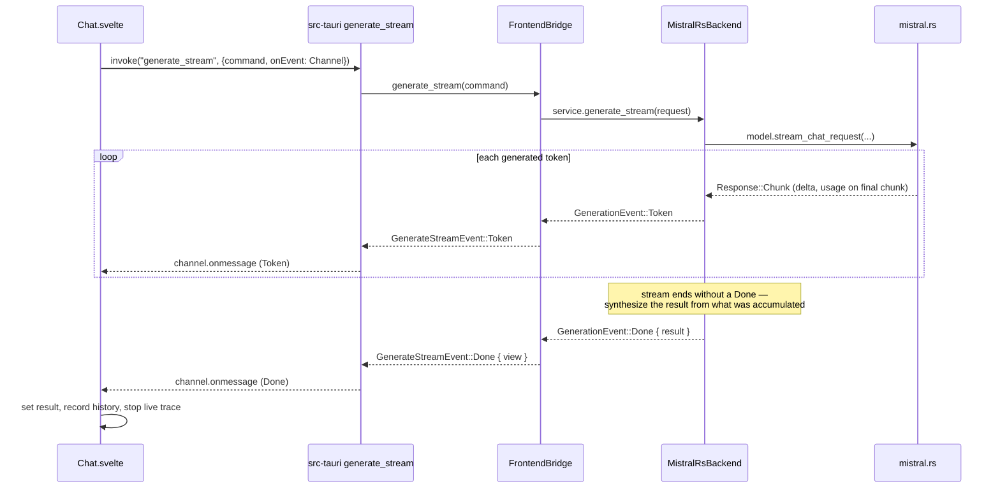

#  inferra.rs

> Build, inspect, and understand LLM inference in Rust.

A learning-oriented, production-shaped Rust workspace for understanding LLM
inference with [`mistral.rs`](https://github.com/EricLBuehler/mistral.rs) as
the reference runtime, embedded directly in-process (no server, no HTTP hop).
Two applications sit on the same backend-neutral core: a CLI and a Tauri +
Svelte desktop app.



## Architecture



The rule that matters: applications only ever know `inferra-core`'s neutral
types (`GenerationRequest`, `GenerationResult`, `GenerationEvent`, `Usage`) —
never `mistralrs` types, never Candle tensors. `inferra-mistral` is the only
crate that imports `mistralrs`. That keeps the runtime replaceable (a direct
Candle backend can implement the same `InferenceBackend` trait later) and
gives every consumer — CLI, desktop, any future one — an identical API.

## Module map — Rust workspace

| Crate / path | What it does | Key types |
|---|---|---|
| `crates/inferra-core` | The neutral contract every layer above depends on. Defines chat messages, sampling options, results, the streaming event enum, errors, and the `InferenceBackend` trait itself. Knows nothing about mistral.rs. | `ChatMessage`, `GenerationRequest`/`Result`, `Usage`, `GenerationEvent`, `InferenceBackend` |
| `crates/inferra-mistral` | The only crate that touches `mistralrs`. Loads a local GGUF file in-process via `GgufModelBuilder`, and implements both `generate` (`send_chat_request`) and `generate_stream` (`stream_chat_request`) against the real SDK. Synthesizes the final result from accumulated stream chunks, since mistral.rs's streaming path doesn't reliably emit a terminal `Done` event — see the comment in `generate_stream`. | `MistralRsBackend`, `build_chat_request`, `map_usage` |
| `crates/inferra-app` | Thin backend-independent service. Holds an `Arc<dyn InferenceBackend>` and exposes `generate`/`generate_stream`/`model_info` — nothing else. This is what a CLI or a future non-Tauri consumer talks to directly. | `InferenceService` |
| `crates/inferra-ui-bridge` | UI-facing DTOs and the one place that shapes data for a frontend: converts `GenerationResult` → `GenerateView` (friendlier field names/units), and maps the core `GenerationEvent` stream into a `#[serde(tag = "type")]` `GenerateStreamEvent` a JS `Channel` can consume directly. Depends on `tauri` for nothing — a future non-Tauri UI could reuse it. | `FrontendBridge`, `GenerateCommand`, `GenerateView`, `GenerateStreamEvent` |
| `crates/inferra-gguf` | Real GGUF composition reading (header, metadata, every tensor's shape/dtype/byte size, chat template, special tokens, KV-cache-at-max-context estimate) plus embedding-space sampling for the Model Inspector tab — grew well past Milestone 3's original "header only" scope. | `read_composition`, `sample_embeddings`, `GgufComposition`, `EmbeddingPoint` |
| `crates/inferra-hub` | Thin client for Hugging Face Hub's public REST API — model search, per-repo detail enrichment (parameter count/architecture/context length, fetched concurrently via `JoinSet` since search results don't carry them), and GGUF file listings with real per-file sizes. Nothing hardcoded — every result is a live API call. In-memory, per-endpoint response caching with a TTL supplied per-call (driven by a frontend setting), not persisted across app restarts. Also owns `resolve_gguf_path` — `model_dir` means either a real local directory or a Hugging Face repo id depending on how the model was picked, and this is the one place that resolves either case (falling back to `hf-hub`'s own local cache lookup) for every command that reads a GGUF file directly. | `search_models`, `list_gguf_files`, `resolve_gguf_path`, `ModelSummary`, `GgufFile`, `SortBy` |
| `apps/inferra-cli` | Parses args, builds a `GenerationRequest`, and calls `InferenceService` directly — no Tauri, no bridge. `generate --stream` exercises the same streaming path as the desktop app and prints real time-to-first-token. | `Cli`, `Command` |
| `apps/desktop/src-tauri` | Tauri commands — thin wrappers around `FrontendBridge`/`inferra-gguf`/`inferra-hub`: `load_model`, `generate`, `generate_stream`, `model_info`, `tokenize_text`, `inspect_gguf_composition`, `sample_gguf_embeddings(_near)`, `search_huggingface_models`, `list_huggingface_gguf_files`. Owns zero model configuration; every path/setting comes from the frontend. `generate_stream` forwards each `GenerateStreamEvent` to the frontend over a `tauri::ipc::Channel` as it arrives. | `AppState`, `generate_stream` command |

## Module map — desktop frontend (`apps/desktop/src`)

| File | What it does |
|---|---|
| `lib/api.ts` | The only file that knows the Tauri command names/argument shapes — every `invoke()` call in the app goes through here, including the Hugging Face Hub browsing commands and GGUF inspection commands, not just chat. |
| `lib/state.svelte.ts` | One shared `modelState` (`unloaded`/`loading`/`ready`/`error` + `ModelInfo`/error message + a `kvCache` estimate) — the single source of truth for whether generation is possible, read by the sidebar, chat panel, and history log alike. |
| `lib/modelLoad.ts` | The one place that knows how to go from a `ModelConfig` to a loaded, remembered model (`loadPickedModel`) — shared by the manual/local-file loader and the Hugging Face browser so there's exactly one load path, plus `isActiveModel` and a no-reload `renameActiveModel` for relabeling without re-hitting the backend. Also fetches the model's KV-cache-per-token estimate once at load time (cheap — GGUF metadata only) so the live per-token cache readout works without a Model Inspector visit first; best-effort, since it's a nice-to-have, not core to having a usable model. |
| `lib/persist.ts` | `localStorage`-backed "recent models" (up to 5), keyed by model dir + GGUF filename. Best-effort only — never load-bearing. |
| `lib/settings.svelte.ts` | Shared, `localStorage`-persisted app preferences (history size/order, Hugging Face Hub cache TTL) — the single `AppSettings` object every settings disclosure panel reads and writes. |
| `lib/history.svelte.ts` | Session-only array of every completed generation's real metrics (model label, elapsed, prompt/completion tokens, prefill/decode tok/s and time) — feeds the gauge, both bar charts, and the generation log. |
| `lib/live.svelte.ts` | The in-flight generation's token-arrival trace (`{ms, tokens}` points, real measured timestamps) plus the request's token budget and real prompt-token count (via `tokenize_text`, captured before streaming starts — mistral.rs's own usage stats only arrive on the terminal event, too late for a live number). Reset per generation via `startLive`/`recordToken`/`stopLive`. |
| `lib/logprobs.svelte.ts` | Per-token confidence state for the live trace, from mistral.rs's real logprobs (temperature > 0 only — greedy sampling doesn't report them). |
| `lib/format.ts`, `lib/markdown.ts` | Small `null`-safe formatters (seconds, tok/s, token/byte counts, relative time) and the chat response's Markdown renderer, shared across the metrics and chat components. |
| `lib/ModelLoader.svelte` | The sidebar: native file-picker (`@tauri-apps/plugin-dialog`) that auto-loads on pick, the recent-models list (also auto-loads, no-ops if already active, inline rename via a ✓/✕ affordance), and a collapsed manual-config fallback. |
| `lib/ModelBrowser.svelte` | Live search/browse against Hugging Face Hub — GGUF, text-generation models only, sortable, with real metadata (params/architecture/context length) visible inline, a per-repo file picker showing real file sizes, and a "view on Hugging Face" link that opens the system browser rather than navigating the app's own webview. |
| `lib/Chat.svelte`, `lib/MarkdownText.svelte` | The prompt form and rendered response. Drives `generateStream`, appending each token live and recording `history`/`live` state as events arrive; `busy` is set from the terminal event itself, not from the outer promise, to avoid a display race. |
| `lib/LiveTrace.svelte` | Live table of the in-flight generation, one row per real token arrival: token text, gap since the previous token, a running KV-cache-size column (prompt + tokens so far, from the model's real per-token byte estimate), and confidence where available. |
| `lib/Gauge.svelte`, `lib/Metrics.svelte` | Ring gauge (decode tok/s as % of this session's own peak) and stat tiles (elapsed, prefill, decode, prompt/completion tokens) for the latest completed generation. |
| `lib/HistoryChart.svelte`, `lib/LatencyChart.svelte`, `lib/HistorySettings.svelte`, `lib/GenerationLog.svelte` | Session-long bar charts (decode throughput per run; a prefill/decode stacked-time breakdown per run — both straight from `Usage`), the retention/order settings for them, and the underlying table (which model, prompt, response, decode rate) so a chart bar can always be traced back to what actually ran, including across a model switch mid-session. |
| `lib/GgufComposition.svelte`, `lib/EmbeddingScatter.svelte` | The Model Inspector tab: real byte-for-byte GGUF composition (header/metadata/tensor sizes, a weights-vs-KV-cache-at-max-context comparison) and a 3D scatter of sampled embedding vectors — both reading the GGUF file directly, no network involved. |
| `routes/+page.svelte` | The app shell: header status dot, sidebar + tabbed main content (Chat, Session metrics, Model Inspector, Browse models — all tabs stay mounted, hidden via CSS, so switching tabs mid-generation doesn't lose state), and the dark-first token palette every component consumes. |

## The streaming path, end to end

This is the one flow worth understanding in full, since it crosses every
layer and was the source of several real bugs along the way:



Two non-obvious things baked into this, both discovered by testing against a
real model rather than assumed:

- **mistral.rs's streaming API doesn't reliably send a terminal `Response::Done`.**
  It just stops emitting `Chunk`s, with `usage`/`finish_reason` carried on the
  *last* chunk instead. `MistralRsBackend::generate_stream` accumulates text
  and the last-seen usage as chunks arrive and treats stream exhaustion itself
  as the completion signal, synthesizing `Done` — falling back to an actual
  `Response::Done` if one *does* show up on some path.
- **A near-zero timing denominator can make mistral.rs report `inf`/`NaN`** for
  a tok/s rate, which `serde_json` refuses to encode — silently breaking the
  Tauri `Channel` send. `map_usage` converts any non-finite rate to `None`
  (the correct "not available" value) before it ever reaches serialization.

## What mistral.rs offers that isn't wired up yet

Verified against the real `mistralrs` source, not assumed:

- **Per-token sampling knobs** beyond temperature/top_p/max_len: `top_k`,
  `min_p`, `frequency_penalty`, `presence_penalty`, `repetition_penalty`,
  `stop_toks`, `logits_bias`, DRY sampling (`dry_params`).
- **Per-token log-probabilities**: `RequestBuilder::return_logprobs(true)`
  returns each token's logprob plus its top alternative candidates
  (`ResponseLogprob`/`TopLogprob`) — real model-confidence data, not derived.
- **Custom logits processors**: `RequestBuilder::add_logits_processor` accepts
  an `Arc<dyn CustomLogitsProcessor>` — an arbitrary hook into the raw logits
  at every decode step, not just a config knob.
- **GPU acceleration feature flags**: `metal`, `accelerate`, `mkl`, `cuda`.
  We run `accelerate` (Apple's Accelerate.framework BLAS) after `metal`
  crashed at runtime on this machine's Intel/discrete-GPU combo — see the
  `mistralrs` line in `crates/inferra-mistral/Cargo.toml`.
- **Vision and video multimodal inference.** Not a someday feature we'd have
  to bolt on — it's already sitting in the exact `mistralrs` version we've
  pinned: `MultimodalModelBuilder` (`mistralrs-0.8.1/src/multimodal_model.rs`)
  takes image attachments alongside text (`messages.rs`'s `images:
  Vec<DynamicImage>`), and `mistralrs-core-0.8.1/src/video_input.rs` handles
  video input as its own first-class path, not images-as-frames bolted on.
  Wiring this in is a new `InferenceBackend` shape (or an extended one) that
  can carry an attachment alongside the prompt — see Milestone 8.

## Run

**CLI:**

```bash
cargo run -p inferra-cli -- \
  --model-dir /path/to/gguf/dir \
  --gguf-file model.Q4_K_M.gguf \
  generate "What is inference? Answer in one sentence."

# streaming, with real time-to-first-token:
cargo run -p inferra-cli -- \
  --model-dir /path/to/gguf/dir --gguf-file model.Q4_K_M.gguf \
  generate --stream "What is inference?"
```

`info`/`inspect-gguf` don't need a model loaded — they still parse
`--model-dir`/`--gguf-file` but ignore them.

**Desktop:**

Requires [Rust](https://rustup.rs) and [Bun](https://bun.sh) installed first.

```bash
cd apps/desktop
bun install
bun run tauri dev
```

`tauri dev` compiles in debug mode by default — fine for UI work, but the
unoptimized build is dramatically slower for actual generation (expect
seconds per token instead of tens of milliseconds, especially for quantized
models). For a real read on inference speed, run `bun run tauri dev --release`
instead; it's the same hot-reloading dev session, just with an optimized
backend. The first release build compiles the whole dependency tree from
scratch and can take several minutes — later runs are fast, since Cargo
caches `target/release` the same way it caches `target/debug`.

Two ways to pick a model, both in the sidebar:

- **Choose a GGUF file…** — pick a file you already have locally (auto-loads
  on selection); override the tokenizer/chat-template source under "Manual
  configuration" for GGUFs that don't embed their own.
- **Browse models** tab — search Hugging Face Hub directly from the app (GGUF,
  text-generation models only), see real parameter count/architecture/context
  length inline, and load a model straight off the Hub with no separate
  download step. Good starting point if you don't have a GGUF file yet:
  search "smollm2" for something small enough to try immediately.

## Verify locally

```bash
cargo fmt --all --check
cargo check --workspace
cargo test --workspace
cargo clippy --workspace --all-targets -- -D warnings

cd apps/desktop && bun run check && bun run build
```

## Milestones

1. ~~**Backend boundary:** non-streaming chat.~~ Done — now embedded, not via `mistralrs-server`.
2. ~~**Observability:** streamed tokens, TTFT, decode tokens/s.~~ Done — see "The streaming path" above.
3. ~~**Artifacts:** expand `inferra-gguf` from header reading to real tensor enumeration.~~ Done — full composition (tensors, metadata, chat template, KV-cache estimate) plus embedding sampling, surfaced in the Model Inspector tab.
4. **Direct Candle:** tokenize, load tensors, and reproduce one model forward pass.
5. **Validation:** compare token IDs, layer outputs, logits, greedy output, and speed.
6. ~~**Desktop:** Tauri chat UI consuming only `inferra-ui-bridge`.~~ Done — tabbed UI with live streaming, gauge, and session history/latency charts.
7. **Runtime study:** KV cache, quantization, batching, memory planning, profiling.
8. **Multimodal:** wire up mistral.rs's already-present vision/video path
   (`MultimodalModelBuilder`, `video_input.rs`) — pick a model, drop in an
   image or a clip, watch it describe what's actually there.

`mistral.rs` is the reference runtime; GGUF learning remains isolated in
`inferra-gguf`.
